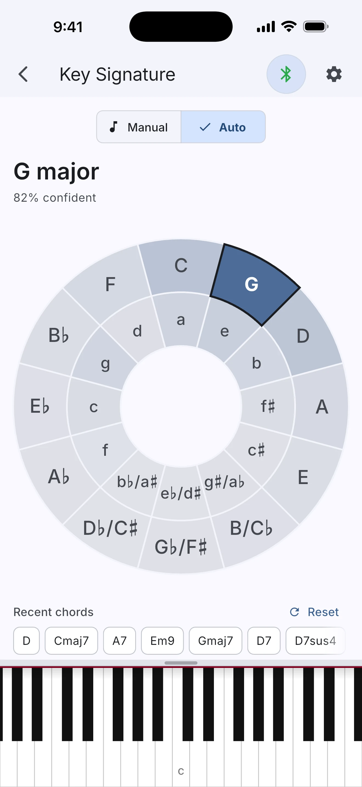

# WhatKey

[](https://doi.org/10.5281/zenodo.21322675)

WhatKey is a streaming key-estimation system for [WhatChord](../../README.md),
pictured below as the app's automatic Key Signature indicator. It listens to the
recent chords you play, keeps track of which keys best explain them, and only
shows a key when the evidence is strong enough instead of guessing. The
confidence shown in the app uses a frozen display-only calibration without
changing which key the detector chooses.

## Project status

**The research phase is complete, and publication is closed.** WhatKey remains
an open engineering and research archive, but the manuscript will not be
resubmitted to TISMIR or pursued at another venue in its present form.

The final journal-preparation audit confirmed that the experiments are
reproducible and the reference-dependent ranking reversal is real. It also found
that the central lesson is too close to established work on reference and
annotator dependence to justify further publication effort without a
substantially new study. The causal detector, protocol, correction record,
negative results, and reproducibility machinery remain useful outcomes. The
complete reasoning and deferred ideas are recorded in the
[publication-closure entry](log/2026-08-02-01-close-publication-path.md).

The Zenodo preprint remains an archival, non-peer-reviewed record. The
repository manuscript is a later post-audit working draft, not a planned
submission.

Start here, depending on what you want:

- **Skimming?** [CONTRIBUTION.md](CONTRIBUTION.md) preserves the original
  plain-English contribution framing and now points back to the closure audit.
- **Want the science?** Read the final working manuscript:
  [paper/main.pdf](paper/main.pdf). It is not planned for submission.
- **Want to check our work?** [REPRODUCING.md](REPRODUCING.md) rebuilds every
  reported number from pinned upstream sources.

<p align="center">
  
</p>

## Research question

"What key am I in right now?" Many key-detection benchmarks ask for one answer
after reading a complete score or recording. WhatKey instead studies a specific
interactive setting in which the answer is updated while the music is still
happening. That setting combines three requirements:

1. **Causal and streaming.** The detector only ever sees the past, and it must
   update as each chord arrives from live MIDI playing with finger rolls, pedal
   blur, and wrong notes.
2. **Uncertain observations.** The input is not ground-truth notes but the
   output of WhatChord's chord recognizer: ranked candidates with explanation
   costs (the recognizer's own measure of how well the notes fit each reading).
3. **Abstention as part of the task.** Some modal or tonic-ambiguous passages do
   not have one appropriate label inside a 24-key major/minor answer space. The
   detector can say "not enough evidence" rather than force a weak answer, so
   stability and knowing when not to answer are measured alongside accuracy.

The work is organized as a research project rather than only an app feature: a
frozen evaluation protocol, versioned fixtures, external reference points, dated
experiment logs, and a held-out evaluation declared before running.

## Frozen held-out result

The table below records the detector that came out of the frozen protocol. The
final detector is a compact
[hidden Markov model](https://en.wikipedia.org/wiki/Hidden_Markov_model) run
strictly forward in time. It keeps a probability distribution over the 24 major
and minor keys, updates it from recent chord evidence, and abstains when the
leading candidates are too close. The detector ranks keys and decides when to
abstain using its raw probabilities; the number shown to users passes through a
display-only calibration step. The measurement terms used below are defined in
the [glossary](../GLOSSARY.md).

| system                         | coverage | exact | MIREX |
| ------------------------------ | -------- | ----- | ----- |
| WhatKey (causal, abstaining)   | 0.88     | 0.732 | 0.782 |
| music21 Temperley-Kostka-Payne | 1.00     | 0.637 | 0.740 |
| music21 Krumhansl-Schmuckler   | 1.00     | 0.624 | 0.726 |
| music21 Aarden-Essen           | 1.00     | 0.558 | 0.690 |

Reading the table: **coverage** is how often the system names a key, **exact**
is how often that key is exactly right, and
[**MIREX**](https://music-ir.org/mirex/wiki/2019:Audio_Key_Detection) is the
field's weighted score for musically close misses. The offline systems always
answer, so their coverage is 1.00. WhatKey declined to answer on 12% of scored
moments and was exactly right on 73% of its claims. The table is descriptive
context, not evidence of parity or superiority: each offline analyzer reads the
complete song and returns one key, whereas WhatKey uses only past events and may
change or abstain after every chord. The evaluation also tracks wrong key
switches, real key-change detection and lag, and time to first claim.

## Main lessons

**Reference-dependent scores are real but not a new general principle.** On the
same performed Beethoven inputs and fixed detector outputs, an analyst-declared
key context favors the responsive configuration while the active notated
key-signature collection favors the stable configuration. This is a useful
construct-sensitivity audit. It does not show that either reference is correct,
that annotation persistence alone caused the reversal, or that reference-
dependent model ranking was previously unknown.

**Protocol discipline was the durable contribution to later work.** WhatKey made
coverage, accuracy on claims, stability, key-change matching, lag, and time to
first claim explicit; separated development from held-out pieces; compared
changes piece by piece; stripped labels before detector calls; and preserved
corrections and null results in dated records. Later WhatChord initiatives
inherited those practices.

**Mode evidence can be isolated.** The most visible residual mistake is showing
the wrong mode, such as C minor instead of C major. The adopted rule looks at
chords built on the tonic: a clearly major or clearly minor C chord helps decide
between the two keys, and by construction it cannot shift support toward any
other key. That roughly halves parallel-mode confusion.

**Negative results are part of the record.** Additional chord-function rules
help only when the goal is local-key tracking; weighting evidence by the chord
recognizer's own confidence never helped in any tested setting; and
adaptive-memory models react faster but make more wrong switches. Each negative
result has a reproducible experiment behind it in the log.

**Confidence needs its own calibration.** The detector's raw probabilities are
overconfident (claiming 91% where it earned 72% on the held-out split), so
WhatKey applies temperature scaling, a standard one-knob correction, only to
displayed probabilities. This makes the user-facing confidence number more
honest without changing the detector's ranked keys, abstention decisions, or
paper results.

## Repository map

- [paper/main.pdf](paper/main.pdf): the final post-audit working manuscript,
  which is not planned for submission (`mise research:whatkey-paper` rebuilds it
  from `paper/main.typ`).
- [CONTRIBUTION.md](CONTRIBUTION.md): the original plain-English contribution
  framing, retained with an archival-status notice.
- [../GLOSSARY.md](../GLOSSARY.md): plain-English definitions of the measurement
  terms, shared across the whole research archive.
- [PROTOCOL.md](PROTOCOL.md): how results are evaluated; frozen, with dated
  amendments.
- [log/](log/): dated experiment entries with exact commands, results, and
  plain-English readings.
- [temporal-context-key-detection.md](temporal-context-key-detection.md): the
  design-time plan and algorithm reference.
- [key-behavior-modes.md](key-behavior-modes.md): informal post-paper
  exploration behind the app's stable/balanced/reactive setting, with its own
  fixed-preset held-out audit; separate from the frozen record above.
- [data/](data/): fixture manifests, split files, provenance, and data access
  notes.
- [results/](results/): committed held-out evaluation artifacts and reports.
- Code:
  - [packages/whatkey/](../../packages/whatkey/): detectors and key-behavior
    presets; this is the same code the harness benchmarks and the app runs.
  - [packages/whatchord/](../../packages/whatchord/): the chord engine,
    including the chord-event model and segmentation the detectors consume.
  - [tool/](../../tool/): harnesses, extractors, baseline runners, and paired
    statistics.

## Reproducing and data access

To reproduce the headline table above by rerunning the detector and music21
baseline code, run this from a fresh checkout:

```sh
mise install
mise research:whatkey-headline-rerun -- --yes
```

This downloads pinned external checkouts into `build/whatkey-corpora/`,
regenerates the Isophonics headline fixtures under `build/whatkey-fixtures/`,
runs the Dart detector and music21 baselines, and compares the regenerated
metrics with the committed expectations. Omit `--yes` to review the download and
license-gated fixture warning before the script proceeds.

For a fast no-download check that the README table still matches the committed
held-out evaluation artifacts, run:

```sh
mise install && mise research:whatkey-headline-verify
```

That command only parses `results/test-split-2026-07-07/`; it does not rerun the
detector or baselines.

[REPRODUCING.md](REPRODUCING.md) has exact steps for rebuilding every fixture
set from pinned upstream checkouts, including the license-gated corpora that are
never committed, and for verifying the frozen development/test splits. Common
invocations are wrapped as `mise research:whatkey-*` tasks. To audit
already-prepared local data without downloading or regenerating anything, use:

```sh
mise research:whatkey-prepare-data -- --headline --verify-only
```

## Citation

If you build on this archive, please cite the non-peer-reviewed preprint:

```bibtex
@misc{bullschaefer2026whatkey,
  author = {Bull Schaefer, Aaron},
  title  = {Streaming Key Estimation with Abstention from Live
            Chord-Recognition Output},
  year   = {2026},
  doi    = {10.5281/zenodo.21322675},
  url    = {https://github.com/EarthmanMuons/whatchord/tree/main/research/whatkey},
  note   = {Preprint. Protocol, experiment log, and evaluation artifacts in
            the linked repository directory.}
}
```

## AI assistance disclosure

This is a human-led research project developed with assistance from AI tools. AI
tools were used for implementation support, code review, editing suggestions,
plain-language explanation, and critique of the paper's structure and wording.
They were not treated as authors or as sources of evidence. The author remains
responsible for the research questions, experiments, statistical claims,
interpretation, data provenance decisions, and final text. Numerical results in
the paper trace to committed code, fixtures, logs, and generated reports rather
than to AI-generated assertions.

## License and data

The code is free, the committed data carries its sources' terms, and the gated
corpora are never committed at all:

- **Code** (detectors, harness, extractors, paper source): the repository's
  top-level [0BSD license](../../LICENSE).
- **Committed fixtures** (`data/fixtures/when-in-rome-v1/`): data artifacts
  under CC BY-SA 4.0 provenance from license-verified When in Rome sub-corpora;
  see [data/provenance/when-in-rome-v1.md](data/provenance/when-in-rome-v1.md).
- **Gated corpora** (ASAP, CC BY-NC-SA 4.0; Isophonics annotations,
  research-distributed): never committed; their extractors refuse to write
  inside `research/`, and they are rebuilt locally per REPRODUCING.md.
- **Split files and results artifacts**: identifiers, aggregate metrics, and
  detector outputs only, never corpus content; each redistribution decision is
  recorded in [data/NOTICE.md](data/NOTICE.md) and the dated log entries it
  points to.
